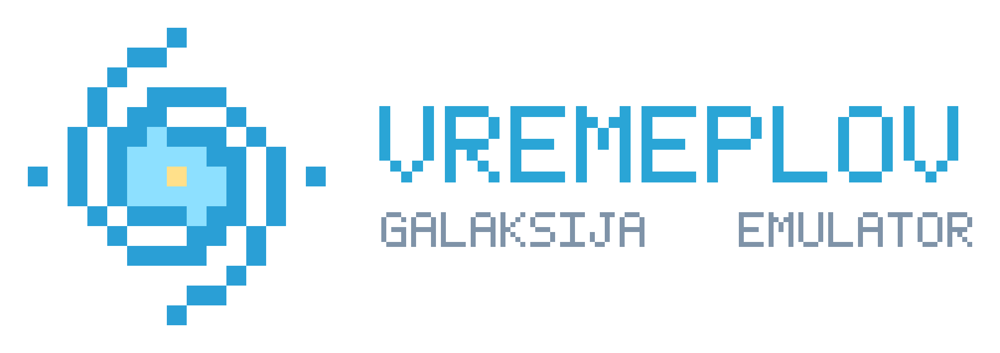
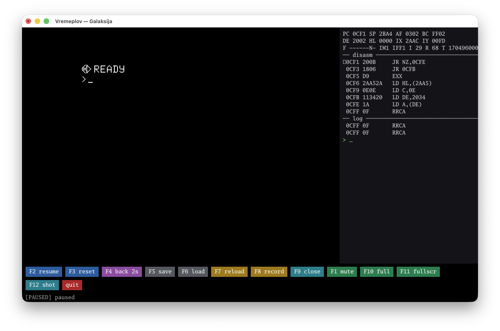
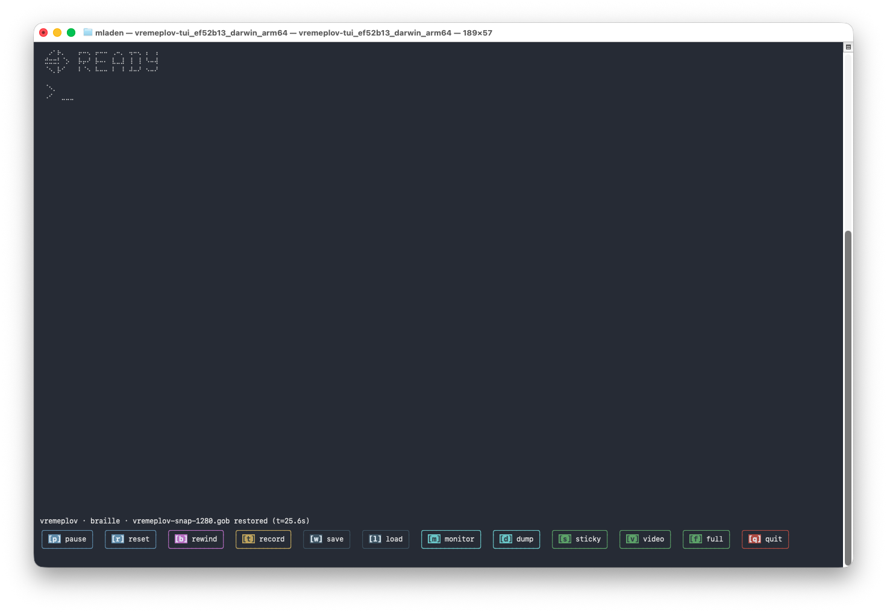

<p align="center">
  
</p>

# Vremeplov

**Vremeplov** (*"time machine"*) is a cycle-accurate emulator of the
**Galaksija**, Voja Antonić's 1983 Yugoslav home computer.

**▶ [Run it in your browser](https://mtrisic.github.io/vremeplov/galaksija/)** — no install needed.

## Features

- **Runs everywhere** — in the browser (WebAssembly), as a native
  desktop app, in your terminal, on Linux, macOS, and Windows (prebuilt
  binaries on the
  [releases page](https://github.com/mtrisic/vremeplov/releases)), or
  headless for scripting and CI.
- **Loads cassette images** — `.gtp` tape images
  and digitized `.wav` cassette recordings; fast-load them instantly, or
  play them through the ROM's own loader.
- **Saves back to tape** — `SAVE` in BASIC and download the recording as
  a `.gtp` image or `.wav` audio you could play into a real Galaksija.
- **Built-in monitor** — a machine-language debugger beside the running
  screen: breakpoints, watchpoints, stepping, live disassembly, memory
  dump/poke — in the terminal, the browser, and the desktop app.
- **A real time machine** — hold rewind and the machine runs backwards;
  the debugger single-steps in reverse, too.
- **Debug in your own editor** — a Debug Adapter Protocol server
  (`vremeplov-dap`) brings breakpoints, stepping (both directions!),
  registers, memory, and disassembly to VS Code, Helix, and any other
  DAP editor — source-level for your own assembly (sjasmplus), and
  disassembly-level for any existing Galaksija program.
- **Cassette-port sound** — the Galaksija had no sound chip, so games
  told you to plug a speaker into the tape port; the browser's Sound
  button is that speaker, and the desktop app has it plugged in from
  the start.
- **Save states** — snapshot the whole machine to a file and resume it
  later, even mid-game or mid-tape-load; one format shared by the
  browser, desktop, terminal, and CLI.
- **Copy & paste** — paste a whole BASIC listing straight into the
  machine (browser, desktop, and terminal), copy the screen text back
  out (desktop and terminal), or pipe a listing through the keyboard
  (headless).

<p align="center">
  
  <br>
  <em>The desktop frontend (macOS) with the built-in monitor opened —
  registers, live disassembly, and the debugger REPL beside the running
  machine.</em>
</p>

<p align="center">
  
  <br>
  <em>The terminal frontend at the BASIC prompt (braille mode, macOS).</em>
</p>

## Contents

[Under the hood](#under-the-hood) ·
[Quickstart](#quickstart) ·
[Frontends](#frontends)
([terminal](#terminal-frontendstui) ·
[desktop](#desktop-frontendsdesktop) ·
[web](#web-frontendswasm) ·
[headless](#headless-cmdheadless)) ·
[Loading programs](#loading-programs) ·
[Recording tapes](#recording-tapes) ·
[Debugging](#debugging-a-galaksija-program) ·
[Editor debugging](#debugging-in-your-editor) ·
[Release builds](#release-builds) ·
[Layout](#layout) ·
[Development notes](#development-notes) ·
[Credits and dedication](#credits-and-dedication) ·
[License](#license)

## Under the hood

Vremeplov is a faithful replica of the Galaksija circuit, not an
approximation. Built in Go on
[gozilog](https://github.com/mtrisic/gozilog), it reproduces the machine
**T-state by T-state**: the CPU itself paints all 384×320 pixels exactly
as the hardware drew them (the Galaksija had no video chip — raster
tricks included), tape pulses follow timing measured cycle-exactly from
the ROM's own SAVE routine, and the core never reads a wall clock —
identical runs produce identical frames and memory, golden-tested down
to the byte.

See [SPEC.md](SPEC.md) for the architecture and hardware reference,
[AGENTS.md](AGENTS.md) for contributor rules (including the hardware
discrepancy log — start there when the emulator disagrees with a document),
and [PLAN.md](PLAN.md) for planned future work.

## Quickstart

**Browser**: just open the
[hosted emulator](https://mtrisic.github.io/vremeplov/galaksija/) and type at
the `READY` prompt.

**Native binaries**: grab the desktop or terminal frontend for your
platform from the
[releases page](https://github.com/mtrisic/vremeplov/releases) and run it —
it boots straight to `READY`.

> **macOS note**: the binaries aren't signed with an Apple Developer ID
> or notarized, so Gatekeeper quarantines browser downloads. Unlock
> and run with:
>
> ```sh
> chmod +x vremeplov-desktop_*_macOS_* && xattr -d com.apple.quarantine vremeplov-desktop_*_macOS_*
> ```
>
> or allow it under *System Settings → Privacy & Security → "Open
> Anyway"* after the first refusal. Windows SmartScreen may similarly
> warn on first run ("More info" → "Run anyway").

**From source** (requires [Go](https://go.dev/dl/)):

```sh
git clone https://github.com/mtrisic/vremeplov
cd vremeplov
go run ./frontends/tui       # terminal frontend (pure Go)
go run ./frontends/desktop   # GUI (needs a C toolchain on linux/macOS)
```

Or open the repo in VSCode → "Reopen in Container" → F5. The devcontainer is
the reference environment: all tests and gate evidence run inside it.

## Frontends

### Terminal (`frontends/tui`)

```sh
go run ./frontends/tui
```

Letters/digits/symbols type directly (`+ * - < > ? ! " #` etc. follow the
Galaksija shift layout), arrows are arrows, Enter = Return, **Esc = Break**,
Backspace = Delete, Tab = List, Ctrl+R = Repeat. The renderer picks the
crispest mode for your terminal size — half-block, quadrant, or braille
sub-cell graphics, falling back to a readable 32×16 text screen (or a
downscaled view) in small panels.

Frontend commands live in the **footer button bar** — click a button
with the mouse, or press `Ctrl+X` followed by the key shown on it:
`q` quit (asks for a `y` to confirm) · `p` pause/resume · `r` reset ·
`b` rewind 2 s (two minutes of history by default; `--rewind N` sets
the window in seconds at ~15 MB per minute, `0` disables) ·
`t` tape recording (SAVE, then again to write
the `.gtp`+`.wav`) · `w`/`l` save/load a snapshot
(`vremeplov-snap-N.gob` in the current directory) · `c` screenshot
(`vremeplov-shot-N.png`; follows the `f` full-frame toggle) ·
`y` copy the screen text to the clipboard · `m` monitor ·
`d` dump 64 KB of memory to a file · `s` sticky keys (for games) ·
`v` cycle renderer · `f` full frame (borders included). The buttons are
color-coded by function where the terminal supports color, gain borders
on tall terminals, wrap on narrow ones, and get out of the way entirely
on very short ones (`Ctrl+X` always works).

The **monitor** (`Ctrl+X m`) is a built-in machine-language debugger that
opens beside the running screen: registers, live disassembly at PC,
breakpoints and memory watchpoints, stepping (`s`, step-over `n`, `to`,
`frame`) — **including backwards**: `bs` reverse-steps exactly one
instruction and `rw` rewinds whole frames — plus hex dump/poke and watch
expressions; type `help` at its prompt. Breakpoints keep working with
the panel closed; a hit pauses the machine and reopens it.

Clipboard, terminal style: **pasting into the terminal** (Cmd+V,
middle-click — whatever your terminal uses) types the text straight
into the machine, validated first, even over SSH; with the monitor
open it lands on the REPL prompt instead. `Ctrl+X y` copies the screen
text back out via OSC 52 — supported by iTerm2, kitty, WezTerm, tmux
and friends (macOS Terminal.app ignores it).

Built on the excellent [Bubble Tea](https://github.com/charmbracelet/bubbletea)
TUI framework (with [Lip Gloss](https://github.com/charmbracelet/lipgloss)
styling) — a joy to work with.

### Desktop (`frontends/desktop`)

```sh
go run ./frontends/desktop              # needs a C toolchain on linux/macOS
go run ./frontends/desktop game.gtp     # load a tape (or .gob snapshot) at startup
```

A native window: the screen at the largest pixel-perfect integer scale
that fits, real keydown/keyup (hold a key, the matrix holds it — same
layout translation as the browser), and the cassette-port speaker
**plugged in from the start** (no Sound button needed; F1 mutes it).
**Drop a `.gtp` or `.wav` on the window** to load and run it; dropping
a `.gob` resumes a snapshot.

Everything lives on the clickable footer buttons and their F-keys —
the Galaksija has no function keys, so they never collide with the
machine: F2 pause · F3 reset · F4 rewind 2 s (hold to keep going) ·
F5/F6 save/load snapshot (`vremeplov-snap-N.gob`) · F7 reload tape ·
F8 record (SAVE, then again to write `vremeplov-tape-N.{gtp,wav}`) ·
F9 monitor (the same debugger as everywhere else, docked beside the
screen) · F10 full frame · F11 fullscreen · F12 screenshot. Closing
the window asks for confirmation first. Flags match the TUI
(`--rom-a/--rom-b/--chargen/--ram/--rewind`).

**Copy & paste**: `⌘V`/`Ctrl+V` types the clipboard into the machine
(a whole BASIC listing works; with the monitor open it goes to the
REPL prompt), `⌘C`/`Ctrl+C` copies the screen text out — both also
live on footer buttons. Ctrl otherwise stays the Galaksija REPT key;
only those two chords are stolen. On Linux the clipboard needs
`xclip` or `xsel` installed.

Building from source: Windows needs nothing beyond Go; macOS needs the
Xcode command-line tools; Linux needs the X11/GL/ALSA dev headers (the
package list is in `.devcontainer/Dockerfile`).

Built on the excellent [Ebitengine](https://ebitengine.org) game engine —
window, input, and low-latency audio in pure Go spirit, everywhere.

### Web (`frontends/wasm`)

Hosted at [mtrisic.github.io/vremeplov/galaksija](https://mtrisic.github.io/vremeplov/galaksija/),
or build and serve locally:

```sh
bash tools/build-wasm.sh   # builds web/vremeplov.wasm + wasm_exec.js
go run ./tools/serve       # http://localhost:8080
```

Canvas at 2× with real keydown/keyup (hold a key, the matrix holds it).
Picking a `.gtp` gives you a clean machine running that program (reset →
boot → fast-load → `RUN`); *Reload tape* repeats it, *Pause/Resume* freezes
the machine, and *Reset* returns to a fresh `READY` prompt. *Monitor*
opens the same debugger as the TUI's (breakpoints, watchpoints, stepping,
disassembly — type `help` at its prompt); keys reach the machine unless
the prompt has focus, so you can type BASIC while watching the registers.
*Record* captures SAVEs and downloads them as `.gtp` or `.wav`; the picker
also accepts digitized `.wav` cassette audio. *Shot* downloads the screen
as a pixel-exact PNG. *Sound* plugs the virtual speaker into the cassette
port — games with tape-output effects click and beep like they did on the
real machine. *Save*/*Load* in the state
group download the whole machine as a snapshot file and resume it exactly
(the same format the TUI and CLI use, so states move between frontends).
Paste (Ctrl+V) types a whole BASIC listing straight into the machine, and
holding *⏪ 2s* scrubs time backwards — the emulator isn't called "time
machine" for nothing.

### Headless (`cmd/headless`)

The automation and test harness — boots, runs for a fixed amount of emulated
time, dumps state:

```sh
go run ./cmd/headless --frames 100 --dump-frame f.png --dump-mem m.bin
go run ./cmd/headless --frames 100 --screen-text          # decoded 32×16 text
```

Flags: `--rom-a v28|v29|path`, `--rom-b embedded|path`, `--chargen
elektronika|mipro|path`, `--ram 2|4|6|expanded`, `--frames N` / `--tstates N`,
`--dump-frame out.png` (`--crop` for the 256×208 active area),
`--dump-mem out.bin[:0xSTART-0xEND]`, `--keys script`, `--load-bin 0xADDR:file`,
`--snapshot-save/--snapshot-load`, `--screen-text`.

## Loading programs

Four paths, all deterministic:

```sh
# 1. Faithful tape playback: types OLD, plays the pulse schedule through
#    the ROM's own loader (--turbo runs the whole tape first, then the
#    --frames budget; without it the tape plays inside the budget).
#    Also takes digitized cassette audio: --tape dump.wav plays the
#    decoded pulses with their original timing.
echo RUN | go run ./cmd/headless --tape prog.gtp --turbo --type - \
    --frames 300 --dump-frame out.png

# 2. Fast-load: pokes the decoded GTP sections into memory after boot.
echo RUN | go run ./cmd/headless --load-gtp prog.gtp --type - --frames 300

# 3. Type a BASIC listing through the keyboard ('-' reads stdin; put RUN
#    on the last line to start it).
go run ./cmd/headless --type examples/hello.bas --frames 200 --screen-text

# 4. Raw binary poke.
go run ./cmd/headless --load-bin 0x2C3A:prog.bin --frames 100
```

GTP *turbo* blocks (a third-party fast-save variant with the same payload
layout) load too — fast-load pokes them and faithful playback plays them at
standard speed, since no stock ROM reads turbo pulses (see SPEC §3.7).

Sample `.gtp` images live in `core/gtp/testdata/` (provenance in
[roms/PROVENANCE.md](roms/PROVENANCE.md)). Try:

```sh
echo RUN | go run ./cmd/headless --tape core/gtp/testdata/hackaday.gtp \
    --turbo --type - --frames 300 --dump-frame wrencher.png
```

## Recording tapes

The tape deck records too: arm the recorder, `SAVE` in BASIC, and get a
`.gtp` back — the pulses the ROM writes are decoded with the same measured
timing the loader uses, so the full circle is exact:

```sh
# Type a program, SAVE it, write the capture as a GTP image…
printf '10 PRINT 123\nSAVE\n' | go run ./cmd/headless --type - \
    --record-tape hello.gtp --frames 1200

# …and load it back through the ROM's own tape routine.
echo RUN | go run ./cmd/headless --tape hello.gtp --turbo --type - \
    --frames 100 --screen-text
```

Recording works as audio too — give `--record-tape` a `.wav` path and it
writes a 44.1 kHz mono recording of the SAVE waveform you could, in
principle, play into a real Galaksija.

Interactively: `Ctrl+X t` in the terminal frontend or **F8** in the
desktop app (both write `vremeplov-tape-N.gtp` **and** `.wav`), or the
*Record* button in the browser (downloads `.gtp` or `.wav` per the
format selector).

## Debugging a Galaksija program

- Interactively: `Ctrl+X m` in the terminal frontend, **F9** in the
  desktop app, or the *Monitor* button in the web emulator opens the
  monitor: breakpoints, watchpoints, stepping, disassembly, hex
  dump/poke (see [Terminal](#terminal-frontendstui) above).
- **In your editor** — see
  [Debugging in your editor](#debugging-in-your-editor) below.
- `--screen-text` prints the decoded screen; `--dump-frame` renders the real
  pixels (the two can disagree — the pixel pipeline is the truth).
- `--dump-mem out.bin:0x2800-0x3000` slices memory. Note it reads through the
  CPU's eyes: if the machine stopped mid-ISR with latch b7=0, the A7 clamp
  aliases 0x28xx–0x3Fxx reads (AGENTS.md log 14).
- `--keys script` injects T-state-stamped key events (`<tstate> down A`);
  identical scripts replay identically, byte for byte.
- `--snapshot-save` / `--snapshot-load` freeze and resume a machine (tape
  deck included), for bisecting long runs.
- BASIC program text lives at 0x2C3A (pointers at 0x2C36/0x2C38); video RAM
  is 0x2800–0x29FF.

## Debugging in your editor

`vremeplov-dap` (in `cmd/dap`, prebuilt on the releases page) is a
**Debug Adapter Protocol** server hosting a Galaksija — so any DAP
editor debugs Z80 programs running in the emulator with its native UI:
breakpoints, stepping, registers and flags, a live memory view, and
disassembly. Two headline tricks:

- **Step backwards.** The adapter rides the time machine:
  `stepBack`/`reverseContinue` are real, exact, and undo memory writes.
- **The debug console is the monitor.** Type any monitor command
  (`help`, `x 2800`, `w 9000 w`, `poke`, …) at the debug console.

Write your own assembly with source-level debugging (assemble with
[sjasmplus](https://github.com/z00m128/sjasmplus): `--raw=prog.bin
--sld=prog.sld`), or debug **any existing `.gtp`** at the disassembly
level. An optional `"screen"` address serves the live Galaksija
display at a local URL — open it in a browser next to your editor.
A ready-made example lives in [examples/asm](examples/asm/).

**VS Code**: install the **Galaksija Debug** extension — the
platform-specific packages on the
[releases page](https://github.com/mtrisic/vremeplov/releases) (and
the marketplace) **bundle the adapter**, so the extension is all you
need. (Source: [editors/vscode](editors/vscode/);
`tools/build-vsix.sh` builds the bundled packages.) Then:

```json
{
  "type": "galaksija", "request": "launch", "name": "Debug prog.asm",
  "program": "${workspaceFolder}/build/prog.bin", "org": "0x8000",
  "sld": "${workspaceFolder}/build/prog.sld", "screen": "127.0.0.1:8390"
}
```

**Helix** (no extension needed — Helix speaks DAP natively), in
`languages.toml`:

```toml
[[language]]
name = "z80asm"  # or attach the debugger to your asm language entry
[language.debugger]
name = "vremeplov-dap"
transport = "stdio"
command = "vremeplov-dap"

[[language.debugger.templates]]
name = "binary"
request = "launch"
completion = [ { name = "binary", completion = "filename" } ]
args = { program = "{0}", org = "0x8000", sld = "build/prog.sld", screen = "127.0.0.1:8390" }
```

Launch arguments: `program` (.gtp/.wav/.bin) · `org` (bin load
address) · `entry` (address **or SLD label**) · `sld` + `sourceRoot` ·
`ram`/`rom` · `stopOnEntry` · `history` (rewind seconds for reverse
debugging, default 30) · `screen`. Data breakpoints aren't in v1 —
set watchpoints from the debug console (`w ADDR[-END] r|w|rw`); hits
still stop the editor with a proper reason.

## Release builds

`tools/build-tui.sh` cross-compiles the terminal frontend, and
`tools/build-dap.sh` the debug adapter (both pure Go, so no toolchains
beyond Go itself):

```sh
bash tools/build-tui.sh              # dist/: linux amd64+arm64, macOS amd64+arm64, windows 386
VERSION=v1.0.0 TARGETS="linux/arm64" bash tools/build-tui.sh out/
```

`tools/build-desktop.sh` builds the desktop frontend, which uses cgo on
linux/macOS, so targets are grouped by build host: a linux host builds
its native architecture + `windows/amd64` (Ebiten needs no C compiler
for Windows), a macOS host builds both `darwin` architectures. On tag
releases every artifact is named after the tag itself.

Binaries are named `vremeplov-<frontend>_<version>_<os>_<arch>` (macOS
spelled `macOS`, not `darwin`; version also via `--version`), with a
`SHA256SUMS` file alongside. CI publishes
everything to a GitHub release on every `v*` tag (the desktop matrix
runs on ubuntu + macos runners), and deploys the web emulator + this
page to GitHub Pages on every push to `main`.

## Layout

| Path | What |
|---|---|
| `core/` | The machine (stdlib + gozilog only — enforced by `tools/check-deps`) |
| `core/gtp/` | GTP cassette-image parser |
| `core/loader/` | Shared tape-image → running-program glue |
| `roms/` | Committed ROM images + embedded accessors ([roms/PROVENANCE.md](roms/PROVENANCE.md)) |
| `cmd/headless` | Headless runner — the primary test harness |
| `cmd/dap` | Debug Adapter Protocol server (`vremeplov-dap`) for editor debugging |
| `frontends/tui` | Terminal frontend (bubbletea) |
| `frontends/desktop` | Desktop frontend (Ebiten — the repo's only cgo user) |
| `frontends/wasm` | Web frontend (canvas + `syscall/js`) |
| `web/` | Static page for the web frontend |
| `editors/vscode` | VS Code extension declaring the `galaksija` debug type |
| `examples/` | BASIC listings, preserved `.gtp` games ([credits](examples/PROVENANCE.md)), asm demo |
| `tools/` | Build/check scripts, static server, smoke tests |

## Development notes

- **Determinism**: the core never reads the clock, starts no goroutines, and
  all input is T-state-stamped. Golden tests (`-update` flags in `core` and
  `cmd/headless` after eyeballing) hold the line.
- **WASM portability**: `bash tools/check-wasm.sh` runs the whole core suite
  under Node on js/wasm.
- **Desktop gate**: `bash tools/check-desktop.sh` vets, tests (under
  `xvfb-run` — Ebiten initializes GLFW at package init on linux), and
  builds the desktop frontend for linux and, cross, for Windows. The
  window itself can't open in the container; run it on the host to see it.
- **gozilog**: consumed as a normal tagged Go module. To hack on the CPU
  core and the emulator together, use an uncommitted local replace:
  `go work edit -replace github.com/mtrisic/gozilog=/path/to/checkout`.

## Credits and dedication

The Galaksija exists because a few people decided computers should
belong to everyone:

- **Voja Antonić** designed the Galaksija in 1983 and gave the design
  away — complete schematics and ROM listings, free for anyone to
  build at home. Thousands of people did, in a country where a real
  computer was an import few could afford.
- **Dejan Ristanović** put those plans in front of the public as the
  author behind *Računari u vašoj kući* ("Computers in your home"),
  the legendary special issue of *Galaksija* magazine that turned a
  circuit design into a national phenomenon.
- **Zoran Modli** broadcast Galaksija software over the airwaves on
  his Radio Belgrade show *Ventilator 202* — listeners held a cassette
  recorder up to the radio, and had a program. The digitized tapes
  this emulator decodes are direct descendants of that idea.

Dejan and Zoran are no longer with us. **This repository is dedicated
to all three of them.**

The emulator itself stands on the shoulders of the people who kept the
machine alive and documented long after 1983 — most notably **Tomaž
Šolc**, whose in-depth hardware analyses (memory map, character
generator, composite video timing) are the primary reference this
implementation was built against — as well as the authors of the
annotated ROM disassemblies, the MAME `galaksija` driver, the earlier
open-source emulators, and the archivists who preserved the tapes
(sources in [SPEC.md §9](SPEC.md)). Thank you, all of you.

**Contributions are welcome — from humans and AIs alike.** If the
Galaksija means something to you, or you just find a bug, open an
issue or a pull request: emulation accuracy, new frontends, software
preservation, documentation, translations — it all counts. The
machine was born open; this project stays that way.

## License

MIT (see [LICENSE](LICENSE)). ROM images and sample programs are preserved
historical material with no explicit upstream license; see
[roms/PROVENANCE.md](roms/PROVENANCE.md) and
[examples/PROVENANCE.md](examples/PROVENANCE.md).
